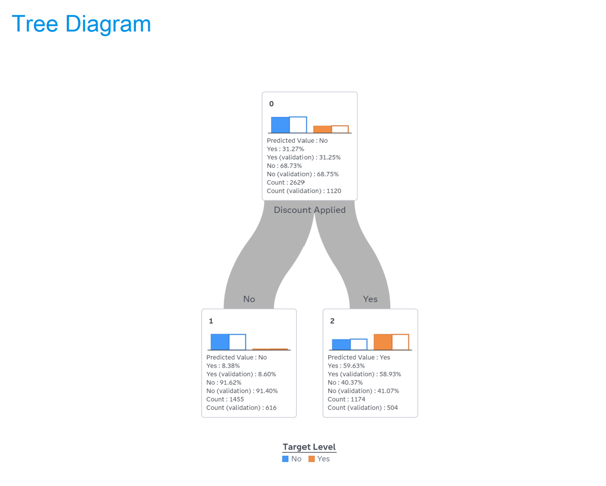
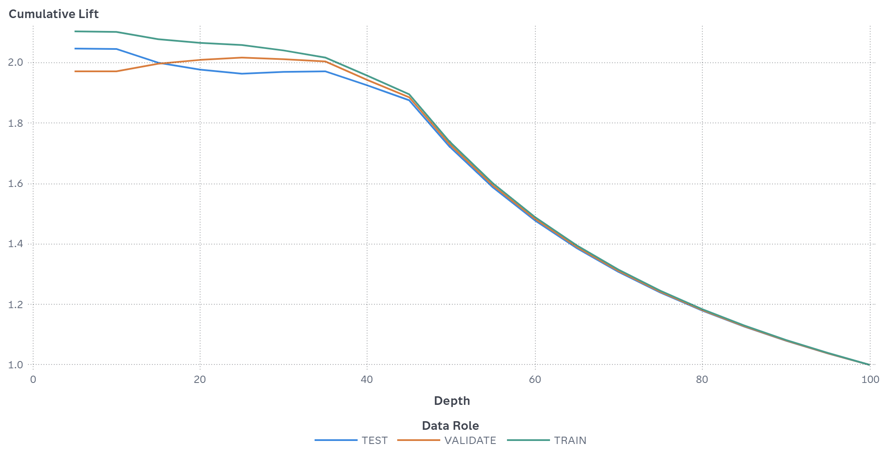
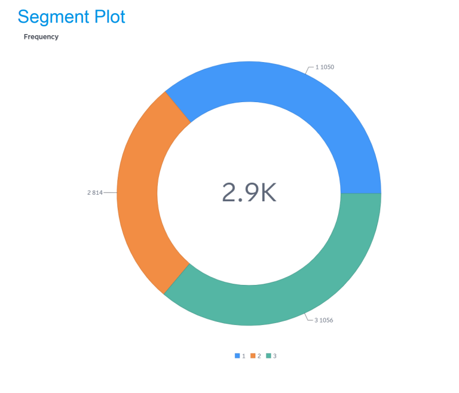
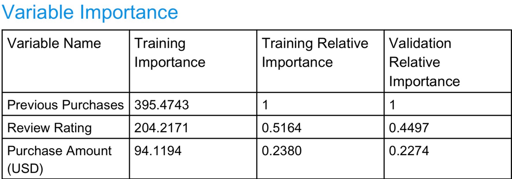

# Customer Subscription Prediction — Customer Shopping Behaviour

Course project for **CCDS 321 – Data Mining**. We analyzed a customer shopping dataset to predict whether a customer subscribes or not, and to find customer segments using clustering. All work was done in **SAS** (SAS Studio for cleaning and EDA, SAS Model Studio for decision trees and clustering).

## Problem

Shopping businesses deal with a lot of customers and often don't understand their behaviour well. The goal was to clean the data, explore it, and build a model that predicts **Subscription Status (Yes / No)**, then see which factors matter the most.

## Dataset

- Based on the Kaggle **Customer Shopping Behavior Dataset**: [link](https://www.kaggle.com/datasets/ankitrajmishra/customer-shopping-behaviour-analysis)
- 5,050 rows and 17 attributes (13 categorical, 4 numerical) before cleaning
- Includes demographics (age, gender, location), purchase details (item, category, amount, size, color, season), and behaviour (subscription status, previous purchases, purchase frequency, payment method, review rating)
- `data/customer_final.csv` is the cleaned version (4,868 rows)

## Data Cleaning

| Step | What we did | Result |
| --- | --- | --- |
| Missing values | Mean imputation for Purchase Amount, Review Rating, Previous Purchases. Mode ("M") for Size | No missing values, no rows deleted |
| Duplicates | Removed fully duplicate rows | 5,050 → 5,000 |
| Inconsistent labels | Autumn → Fall, Fortnightly → Bi-Weekly, Every 3 Months → Quarterly | Season: 4 values, Frequency: 5 values |
| Outliers | Box plot of Purchase Amount per item. Removed extreme values for Shirt, Shoes and Watch | 5,000 → 4,868 |

## Exploratory Analysis — Main Findings

- Only **31.3%** of customers are subscribers.
- Non-subscribers bring more total revenue (~$364K vs ~$245K for subscribers).
- Previous Purchases look almost the same for both groups (median ~25).
- Correlations between the numeric variables (Age, Purchase Amount, Review Rating, Previous Purchases) are all close to zero.
- Purchase Amount is right-skewed (mean $125 vs median $70) because of expensive items like laptops and phones.

**Hypotheses check:**
- H1 (higher purchase frequency → more likely to subscribe): not supported by the EDA.
- H2 (higher review rating → more likely to subscribe): no clear difference between the groups.
- H3 (age and gender affect subscription): not tested directly in this project.

## Modeling

### Task 1 — Decision Trees for Subscription Status

- Data partition: stratified, set as 70 / 30 / 30 for training / validation / test (SAS normalized this to about 54% / 23% / 23%)
- We built 16 trees: 4 splitting criteria (CHAID, Entropy, Gini, Information Gain Ratio) × 2 leaf sizes (3.5%, 6%) × 2 max branches (2, 4)
- Each tree got an overall score:

```
Overall = 0.60 × Accuracy + 0.05 × Simplicity + 0.20 × Lift + 0.15 × Stability
```

**Results:**
- Best default trees: **DT7 (Entropy)** and **DT11 (Gini)**, both with 6% leaf size and 4 branches, overall score **0.841**
- DT7 had a lift of **2.1** at the 2nd decile, so it captures about 2× more subscribers than random selection
- A custom tree (Gini, 2 branches, depth 4, min leaf 100) got the best score: **0.860**, with accuracy **76.9%**

For comparison, predicting "No" for everyone gives 68.7% accuracy, so the model is about 8 points better than the baseline.

The first split in the tree is **Discount Applied**: customers who used a discount subscribe about 60% of the time, compared to only about 8% of those who didn't.





### Task 2 — Customer Segmentation (K-Means)

- Tried k = 2, 3, 4, 5. No outlier clusters in any of them (every cluster is more than 10% of the data)


- **km_3** profile:

| Variable | Cluster 1 | Cluster 2 | Cluster 3 |
| --- | --- | --- | --- |
| Age | Highest | Lowest | Medium |
| Previous Purchases | High | Low | High |
| Purchase Amount | Low | Low | Highest |
| Review Rating | Medium | Highest | Medium |
| Main Category | Clothing | Accessories | Clothing |

- Then we trained 8 decision trees to predict the cluster (10-fold cross validation). All got **94.7%** accuracy, and the simplest ones (**CHAID_2** and **Gini_2**) scored best.

### Task 3 — Decision Trees for Cluster Analysis

- 8 trees (2 vs 4 branches, min leaf 244)
- Best score **0.8503**: Entropy_2, Gini_2, InfoGain_2, InfoGain_4
- 2-branch trees did better than 4-branch trees
- Most important variables: **Previous Purchases, Review Rating, Purchase Amount**



## Conclusion

Purchase amount, rating and previous purchases are weak predictors of subscription. The strongest signal was **Discount Applied**, which the decision tree used as its first split, and the tree beat the baseline. Simpler trees performed as well as or better than deeper ones.

## Repository Structure

```
├── README.md
├── data/
│   └── customer_final.csv
├── images/                             # charts used in this README
└── reports/
    ├── Data_Mining_Milestone1.pdf      # problem, objectives, hypotheses
    ├── Data_Mining_Milestone2.pdf      # data cleaning and statistics
    ├── Data_Mining_Milestone3.pdf      # visualization and correlation
    ├── Data_Mining_Milestone4.docx     # decision trees and clustering
    ├── Data_Mining_Presentation.pptx
    ├── Reports_Before_Cleaning/        # SAS output before cleaning
    └── Reports_After_Cleaning/         # SAS output after cleaning
```

## Tools

SAS Studio · SAS Model Studio

## Team

- Lamees Alharthi
- Joudi Abdulhadi
- Layan Abdullah
- Hala Alsubaie
